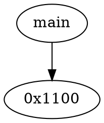

# Ghidra FCG Extraction Scripts

從 binary 提取 Function Call Graph (FCG) 和 High-level Pcode。

## 檔案說明

| 檔案 | 功能 |
|-----|------|
| `get_function_call.sh` | Shell wrapper，批次處理多個 binary（支援 parallel） |
| `ghidra_function_script.py` | Ghidra Python script，提取 FCG (.dot) 和 Pcode (.json) |

## 環境需求

- Ghidra (已編譯)
- GNU Parallel

## 使用方式

```bash
bash get_function_call.sh <GHIDRA_HEADLESS_PATH> <BINARY_FOLDER> [OUTPUT_DIR] [TIMEOUT]
```

**參數：**
- `GHIDRA_HEADLESS_PATH`: Ghidra analyzeHeadless 路徑（如 `/opt/ghidra/support/analyzeHeadless`）
- `BINARY_FOLDER`: 存放 binary 檔案的資料夾
- `OUTPUT_DIR`: 輸出目錄（預設 `./output`）
- `TIMEOUT`: 每個檔案處理超時秒數（預設 1200）

**範例：**
```bash
bash get_function_call.sh /opt/ghidra/support/analyzeHeadless ./binaries ./output 600
```

## 輸出結構

```
output/
├── results/
│   └── <binary_name>/
│       ├── <binary_name>.dot   # FCG (DOT format)
│       └── <binary_name>.json  # Function info + Pcode
├── extraction.log
└── timed_out_files.txt
```

## 輸出格式

**DOT 檔案**：節點為 function entry point offset，邊為 call 關係


**JSON 檔案**：每個 function 的 High-level Pcode
```json
{
  "0x1000": {
    "function_name": "main",
    "instructions": [
      {"address": "...", "operation": "...", "opcode": "CALL"}
    ]
  }
}
```
